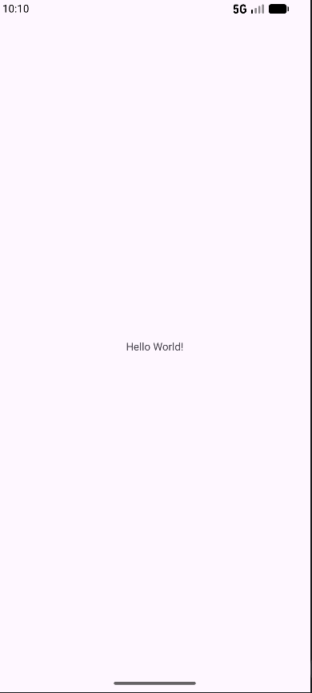

# Pierwsza Potitalna Aplikacja

Aplikacja na Androida witająca urzytkownika

## Zrzut ekranu

## Technologie

Java 17, Android SDK, minSdk 24,Empty Views Activity

## Użyty szablon

Projekt został utworzony za pomocą szablonu Empty Views Activity.

Wybrałem ten szablon, ponieważ korzystamy z klasycznego sposobu tworzenia interfejsu Androida. Wygląd aplikacji znajduje się w pliku XML activity_main.xml, a logika aplikacji znajduje się w MainActivity.java.

Nie wybrałem Empty Activity, ponieważ ten szablon jest przeznaczony dla Jetpack Compose. Na tym etapie zajęć korzystamy z Java + XML + findViewById.

## Uruchomienie

1. Sklonuj repozytorium
2. Otwórz w Android Studio (*File -> Open*)
3. Poczekaj na *Gradle Sync*
4. *Run* -> emulator albo telefon z włączonym debugowaniem USB

## Funkcje

- [x] brak

## Autor

Marcin Cioch 5P

